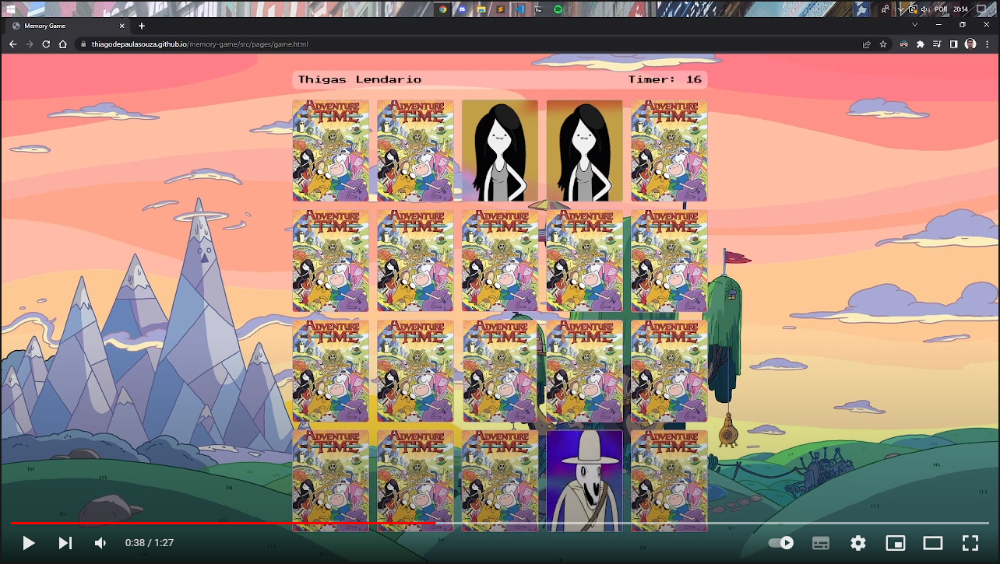

<div id="top"></div>

# Memory Game: Adventure Time
click on the image to be redirected to the video (no audio)
[](https://youtu.be/nVqKD17iHEM)

## About the Project
This is a personal project I'm using to learn more about frontend.

In this project there is a light and dark themed login screen that changes according to your system color scheme and of course a button to switch between light and dark mode.
After logging in I get the input information to present on the next screen, the game screen.
On the game screen, you can see your name and a timer. So now you can play the memory game too, these cards rotate horizontally and show an adventure time character, if you flip two identical cards, the cards stay in place and lose saturation.
When you hit all these cards, you'll see a "win screen", it's a modal that you can go to the homepage, restart or go to this repository.

refs: I see this [video](https://www.youtube.com/watch?v=NV88N1r2Qkg) by [Manual do Dev](https://www.youtube.com/c/ManualdoDev) to get inspired, and I change/add somethings to be more like me.
If you found any bug, go to the [issues](https://github.com/ThiagodePaulaSouza/APS_5-semestre/issues) and write about it, thanks.
I hope that you enjoy. :D

## 🧙‍♂️How to Run:
- Play the game [Here 🎮](https://thiagodepaulasouza.github.io/memory-game/) 
- Have fun! 🎉 
- ~~star my repo :P~~

## 👨‍💻How to help:
##### 1. Before anything:
Fork the project

```bash
# setup your git | don't forget to remove the ()
git clone (YourUrlProject)
git remote add origin (YourUrlProject)
git pull origin
git checkout -b (YourBranch)
```

##### 2. After your amazing feature:
[Follow the pattern of Conventional Commits 🕵️‍♀️](https://www.conventionalcommits.org/en/v1.0.0/) (not required) 
```bash
# after changes | don't forget to remove the () <>
git status
git add (FileThatYouChange)
git commit -m ("<type>: <description>")
git push -u origin (YourBranch)
```

##### 3. Now in your repository fork:
- Click on **Contribute**
- Click on **Compare & pull request**
- Write about your changes
- Click on **Create pull request**

## :memo: License

This project is under the MIT license. See the [LICENSE](https://github.com/ThiagodePaulaSouza/memory-game/blob/main/LICENSE) file for more details.

<p align="right">(<a href="#top">back to top</a>)</p>
